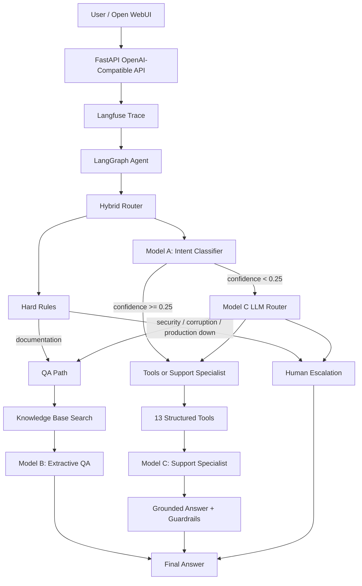

# Multi-Model Agentic Technical Support System

An end-to-end technical support assistant that combines three fine-tuned models, hybrid routing, deterministic tools, LangGraph orchestration, Langfuse observability, an OpenAI-compatible FastAPI API, Docker Compose, Open WebUI, and Dokploy.

## System Overview

The system receives a user support request and routes it to one of four paths:

- **QA** — grounded extractive answers from local technical documentation.
- **Tools** — deterministic diagnostics and structured support tools.
- **Support Specialist** — fine-tuned generative Model C with grounding and safety guardrails.
- **Escalation** — creates a human-support ticket for high-risk cases.

The production router follows:

**hard rules → intent classifier → LLM fallback for ambiguous/low-confidence requests**

## Architecture



---

## Fine-Tuned Models

| Model | Task | Base Model | Baseline | Final |
|---|---|---|---|---|
| **Model A** | 8-class intent classification | `distilbert-base-uncased` | Accuracy **12.5%**, Macro F1 **0.0278** | Accuracy **95.0%**, Macro F1 **0.9495** |
| **Model B** | Extractive technical-support QA | `distilbert-base-uncased` | EM **0.00**, Token F1 **0.4162** | EM **1.00**, Token F1 **1.00** |
| **Model C** | Generative technical-support specialist | `HuggingFaceTB/SmolLM2-135M-Instruct` | Loss **3.2272**, PPL **25.2089**, ROUGE-L **0.1363** | Loss **1.0784**, PPL **2.9399**, ROUGE-L **0.4422**, Golden Set **83.33%** |

Model B's final test set contains only **8 QA pairs**, so its perfect test score should be interpreted as a small-test-set result rather than a broad generalization claim.

### Hugging Face Repositories

- Model A: `JoudAlrubaish/technical-support-intent-classifier`
- Model B: `JoudAlrubaish/technical-support-extractive-qa`
- Model C: `JoudAlrubaish/technical-support-agent-model-c`

Detailed results are stored in:

```text
reports/model_a_results.json
reports/model_b_results.json
reports/model_c_results.json
```

---

## Model A — Intent Classifier

Model A classifies technical-support requests into eight categories:

```text
authentication
network
deployment
database
gpu
api
package
general
```

Dataset:

```text
Total examples: 400
Training: 320
Validation: 40
Test: 40
Examples per class: 50
```

Baseline:

```text
Accuracy: 0.125
Macro F1: 0.0278
```

Fine-tuned result:

```text
Accuracy: 0.95
Macro F1: 0.9495
Minimum class recall: 0.80
```

The classifier passed the defined quality gate.

---

## Model B — Extractive QA

Model B answers technical-support questions by extracting the answer span directly from provided context.

Dataset:

```text
Unique IT issues: 33
Total QA pairs: 66

Training pairs: 52
Validation pairs: 6
Test pairs: 8
```

Baseline:

```text
Exact Match: 0.00
Token F1: 0.4162
```

Final Experiment:

```text
Epochs: 15
Exact Match: 1.00
Token F1: 1.00
```

The test set is small, so this score should not be interpreted as broad production-level accuracy.

---

## Model C — Technical Support Specialist

Base model:

```text
HuggingFaceTB/SmolLM2-135M-Instruct
```

Fine-tuning:

```text
Supervised Fine-Tuning
LoRA
```

Core LoRA configuration:

```text
Rank: 16
Alpha: 32
Dropout: 0.05

Target modules:
q_proj
k_proj
v_proj
o_proj
```

### Experiment Findings

| Experiment | Training | Validation Loss | Perplexity | ROUGE-L | Golden Set |
|---|---|---:|---:|---:|---:|
| Baseline | No fine-tuning | 3.2272 | 25.2089 | 0.1363 | — |
| Exp 1 | 5 epochs | 2.3036 | 10.0102 | — | — |
| Exp 2 | 10 epochs | 1.4185 | 4.1311 | 0.1962 | — |
| Exp 3 | 15 epochs | 1.0825 | 2.9521 | 0.4322 | 50.00% |
| Exp 4 | Targeted refinement | — | — | — | 66.67% |
| Exp 5 | Stronger targeted refinement | — | — | — | 66.67% |
| **Exp 6** | Balanced behavioral refinement | **1.0784** | **2.9399** | **0.4422** | **83.33%** |

Exp 6 was selected as the final model because it achieved the best balance between general performance and behavioral alignment.

---

## Golden Set

The behavioral Golden Set evaluates six important support behaviors:

```text
troubleshooting
network troubleshooting
uncertainty handling
escalation
tool-result synthesis
security escalation
```

Final Model C result:

```text
Passed: 5 / 6
Pass Rate: 83.33%
```

The remaining weakness was:

```text
explicit uncertainty handling
```

This weakness is handled by a deterministic guardrail in the final agent.

---

## Router Evaluation

Three routing strategies were evaluated using the same **12-case router test set**.

| Router | Accuracy | Macro F1 | Average Latency |
|---|---:|---:|---:|
| Rules + Classifier | 0.9167 | 0.9143 | 27.98 ms |
| LLM Router | 0.2500 | 0.1154 | 802.32 ms |
| **Hybrid Router** | **1.0000** | **1.0000** | 137.49 ms |

Hybrid LLM fallback rate:

```text
16.67%
```

These results apply only to the current small evaluation set and are not intended as universal production accuracy claims.

---

## Final Router Policy

The production routing policy is:

```text
1. Apply deterministic hard rules.

2. If a documentation request is detected:
   → QA route

3. If a high-risk condition is detected:
   → Human escalation

4. Otherwise run Model A.

5. If Model A confidence >= 0.25:
   → Use classifier route

6. If confidence < 0.25:
   → Use Model C LLM Router
```

Selected classifier confidence threshold:

```text
0.25
```

This keeps most requests fast while reserving the slower LLM router for ambiguous cases.

---

## Intent-to-Route Mapping

```text
authentication -> support_specialist

network        -> tools
deployment     -> tools
database       -> tools
gpu            -> tools
api            -> tools
package        -> tools

general        -> support_specialist
```

---

## Tools

The system implements all 13 required tool contracts:

```text
1. knowledge_base_search
2. ticket_search
3. ticket_create
4. system_health_check
5. log_analyzer
6. documentation_search
7. package_lookup
8. sql_query
9. calculator
10. file_search
11. web_search
12. escalate_to_human
13. diagnostic_runbook
```

Tools return structured outputs.

The SQL tool is intentionally restricted to:

```text
SELECT-only
```

Unsafe write operations are not allowed.

---

## LangGraph Agent

LangGraph coordinates the complete workflow.

Main nodes:

```text
route_node
qa_node
tool_node
support_node
escalation_node
```

Typical execution paths:

### Documentation Question

```text
User
↓
Hybrid Router
↓
QA
↓
Knowledge Base Search
↓
Model B
↓
Final Answer
```

### Diagnostic Issue

```text
User
↓
Hybrid Router
↓
Tools
↓
Diagnostic Runbook
↓
Model C
↓
Final Answer
```

### General Technical Question

```text
User
↓
Hybrid Router
↓
Support Specialist
↓
Knowledge Grounding
↓
Model C
↓
Final Answer
```

### High-Risk Issue

```text
User
↓
Hard Rule
↓
Human Escalation
↓
Ticket Created
```

---

## Safety and Guardrails

The final system does not rely only on Model C generation.

Guardrails include:

### Explicit uncertainty

When the available evidence is insufficient:

```text
I cannot confirm the exact cause with the available information.
```

is added before troubleshooting guidance.

### Factual grounding

If a factual question has strong retrieved context, the grounded text is returned rather than allowing the LLM to invent the answer.

### Generation corruption detection

Malformed or extremely poor generation can trigger a deterministic fallback based on diagnostic tool results.

### High-risk escalation

The following conditions route directly to human support:

```text
data loss
suspected database corruption
security breach
production down
critical unresolved incident
```

---

## Regression Testing

The end-to-end regression suite currently reports:

```text
13 tests
13 passed
0 failed
```

Tests include:

```text
Documentation QA route
Documentation grounded answer

Database tools route
Database diagnostics used
Database grounded response

QLoRA support route
LLM fallback
QLoRA regression grounding

Corruption escalation
Human escalation
Ticket creation

Explicit uncertainty behavior

Structured health-tool response
```

Results are stored in:

```text
reports/e2e_regression_results.json
```

---

## Observability

Langfuse is integrated through:

```text
src/observability.py
```

Traces include:

```text
trace ID
session ID
router
router source
selected route
agent output
LangGraph callbacks
```

Environment variables:

```env
LANGFUSE_PUBLIC_KEY=
LANGFUSE_SECRET_KEY=
LANGFUSE_BASE_URL=https://cloud.langfuse.com
```

The real `.env` file is excluded from Git.

---

## OpenAI-Compatible API

FastAPI exposes:

```text
GET /health
GET /v1/models
POST /v1/chat/completions
```

The unified model ID is:

```text
tuwaiq-tech-support-agent
```

Both normal and streaming responses are supported.

### Health

```bash
curl http://localhost:8000/health
```

Expected response:

```json
{
  "status": "ok",
  "model": "tuwaiq-tech-support-agent"
}
```

### Models

```bash
curl http://localhost:8000/v1/models
```

### Chat Completion

```bash
curl http://localhost:8000/v1/chat/completions \
  -H "Content-Type: application/json" \
  -d '{
    "model": "tuwaiq-tech-support-agent",
    "stream": false,
    "messages": [
      {
        "role": "user",
        "content": "According to the documentation, which port should be exposed?"
      }
    ]
  }'
```

---

## Run Locally with Python

Create the environment:

```bash
python3 -m venv .venv
```

Activate it:

```bash
source .venv/bin/activate
```

Install dependencies:

```bash
pip install -r requirements.txt
```

Create environment file:

```bash
cp .env.example .env
```

Add Langfuse credentials if tracing is required.

Load environment variables:

```bash
set -a
source .env
set +a
```

Run FastAPI:

```bash
uvicorn src.api:app --host 0.0.0.0 --port 8000
```

---

## Docker Compose

Run:

```bash
docker compose up --build
```

Current services:

```text
Support Agent:
http://localhost:8000

Open WebUI:
http://localhost:3001
```

---

## Open WebUI

Open WebUI connects to the **unified agent endpoint**, not directly to Model C.

Connection configuration:

```text
URL:
http://support-agent:8000/v1

Auth:
Bearer

API Key:
local

API Type:
Chat Completions
```

Detected model:

```text
tuwaiq-tech-support-agent
```

Example verified response:

```text
Question:
According to the documentation, which port should be exposed?

Answer:
Expose port 8000 when deploying the FastAPI service
```

---

## Dokploy Deployment

Dokploy was installed locally inside:

```text
Ubuntu 24.04
Multipass VM
```

Deployment configuration:

```text
Provider:
GitHub

Repository:
JoudAlrubaish/technical-support-agent

Branch:
main

Compose Path:
./docker-compose.yml

Trigger:
On Push
```

The deployment completed successfully.

The Dokploy-hosted Open WebUI was connected to:

```text
http://support-agent:8000/v1
```

and successfully called the unified technical-support agent.

---

## Deployment Ports

Inside the local Dokploy environment:

```text
Dokploy:
192.168.252.2:3000

Support Agent:
192.168.252.2:8000

Open WebUI:
192.168.252.2:3001
```

Open WebUI uses port `3001` because Dokploy itself uses port `3000`.

---

## Deployment Scope

The Dokploy deployment is currently:

```text
Local deployment
```

It runs inside an Ubuntu Multipass VM on the development machine.

A public Internet domain and public HTTPS endpoint were **not configured**, because the deployment was intentionally kept on free local infrastructure.

Therefore:

```text
Dokploy deployment: completed locally
Public HTTPS deployment: not completed
```

---

## Testing Commands

Router evaluation:

```bash
PYTHONPATH=. python tests/test_routing.py
```

End-to-end regression:

```bash
HF_HUB_OFFLINE=1 \
TRANSFORMERS_OFFLINE=1 \
PYTHONPATH=. \
python tests/test_e2e.py
```

---

## Repository Structure

```text
technical-support-agent/
│
├── data/
│   ├── intents.csv
│   ├── qa_train.json
│   ├── sft_train.jsonl
│   └── golden_set.jsonl
│
├── notebooks/
│   ├── 01_model_a_intent_classifier.ipynb
│   ├── 02_model_b_extractive_qa.ipynb
│   ├── 03_model_c_support_specialist.ipynb
│   └── 04_evaluation.ipynb
│
├── reports/
│   ├── model_a_results.json
│   ├── model_b_results.json
│   ├── model_c_results.json
│   ├── router_results.json
│   └── e2e_regression_results.json
│
├── src/
│   ├── api.py
│   ├── graph.py
│   ├── observability.py
│   ├── routers.py
│   ├── specialists.py
│   └── tools.py
│
├── tests/
│   ├── test_routing.py
│   └── test_e2e.py
│
├── .env.example
├── .gitignore
├── Dockerfile
├── docker-compose.yml
├── DESIGN_DECISIONS.md
├── requirements.txt
└── README.md
```

---

## Known Limitations

The current system has several known limitations:

- Router metrics are based on a small 12-case evaluation set.
- Model B's final test contains only 8 QA pairs.
- Model C still requires a deterministic uncertainty guardrail.
- Several tool backends use deterministic/local mock data for demonstration.
- OpenAI-compatible token usage fields currently return zero.
- Dokploy deployment is local rather than public.
- Public HTTPS was not configured.

